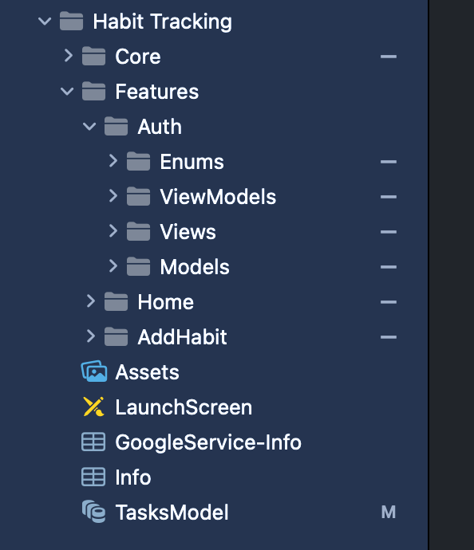
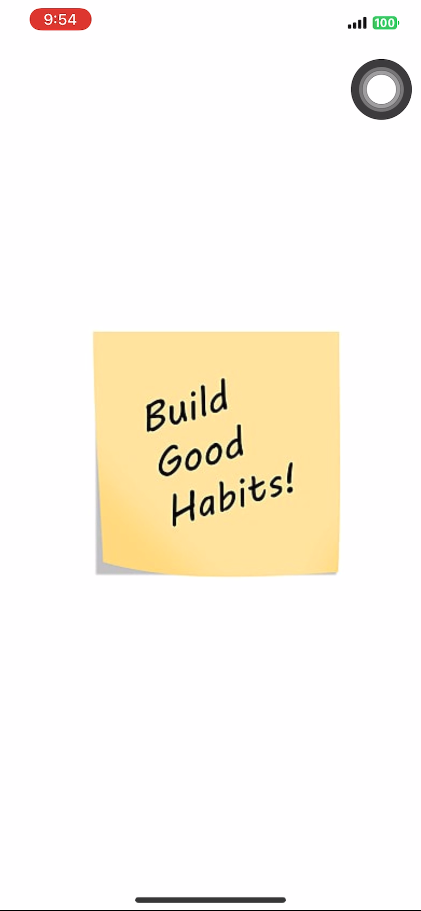
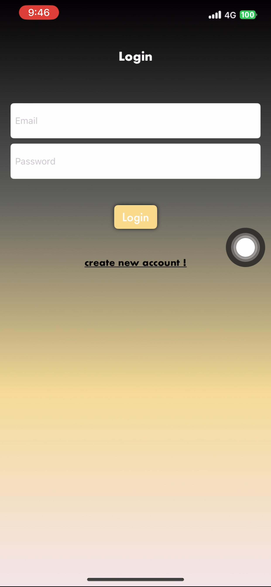
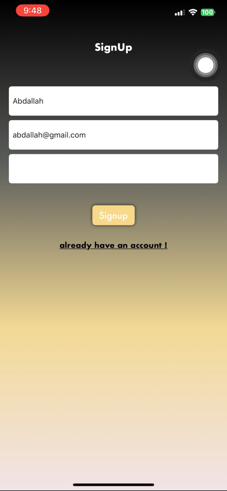
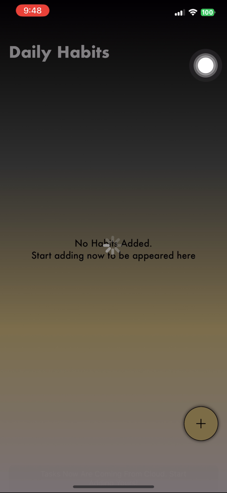
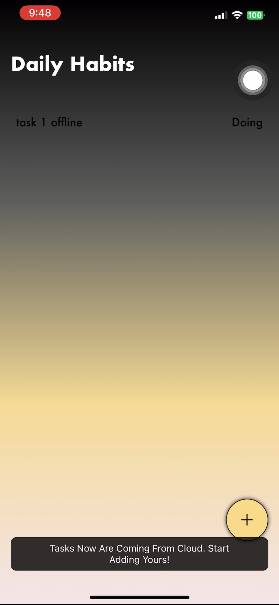
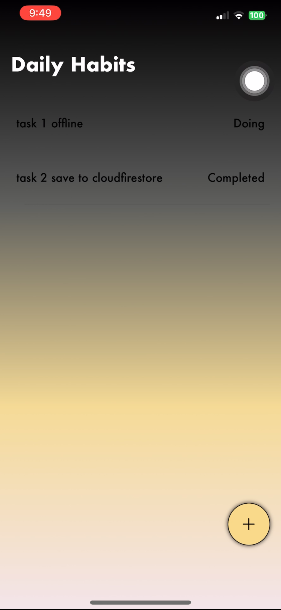
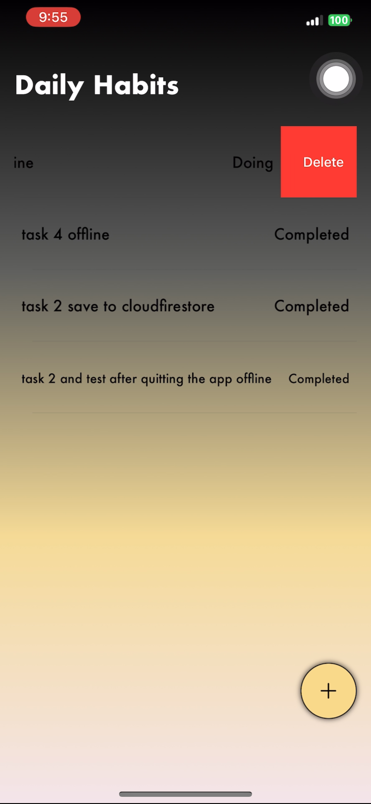
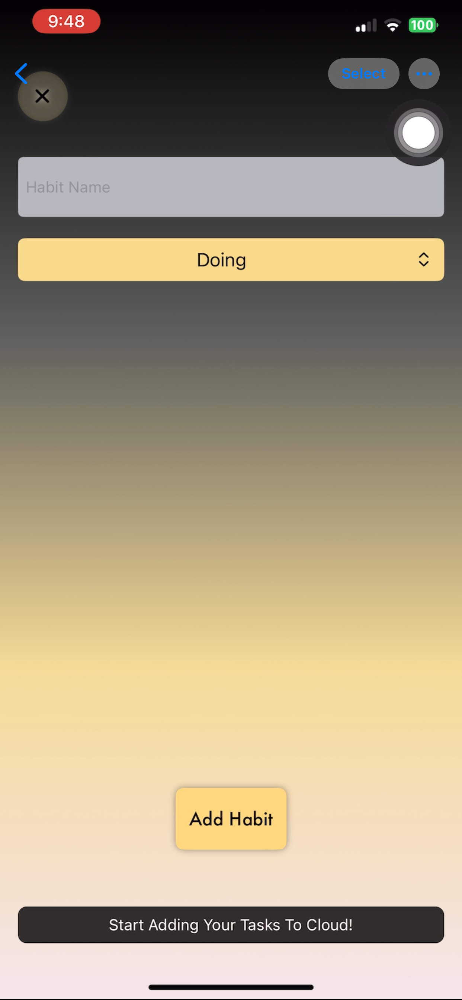
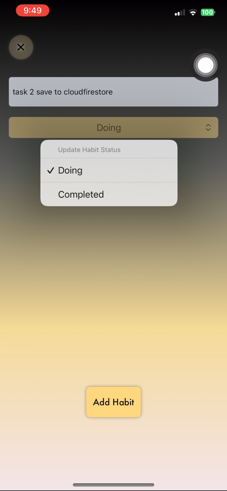

#  HabitTracker

Habit Tracker App where you can add your daily habits and track them whenever you open the app.
This project is built using MVVM + Firebase Firestore (Realtime) + CoreData (Offline Storage).

---

## Instructions
1. Open the project in **Xcode**.
2. Run the app directly — it should work without any additional configuration.

---

##  Features
- Add new habits easily.
- Track habits daily in real-time.
    •    Offline support using Core Data:
    •    Save tasks locally when the user is offline.
    •    Sync remote Firestore with Core Data when the user is back offline.
    •    Ability to delete tasks from Core Data and Firestore.
- Built with **Clean MVVM** for scalability.
- Integrated with **Firebase Firestore** for instant sync.

---

### 1. Project Structure

  
  

---

### 2. Authentication using https://fakeapi.platzi.com
login screen & register screen

  
  

---

### 3. Saving data online to Firestore & fetch it offline using CoreData
home multi screen states online/offline

  
  
  
  

---

### 4. Add Task with task name & status completed or doing
add task screens

  
  

---

